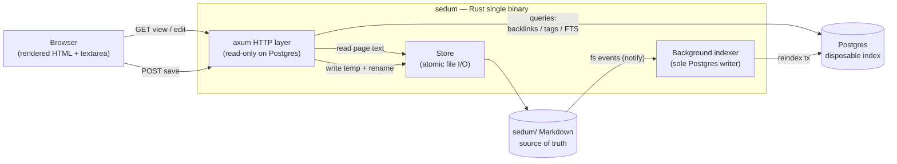
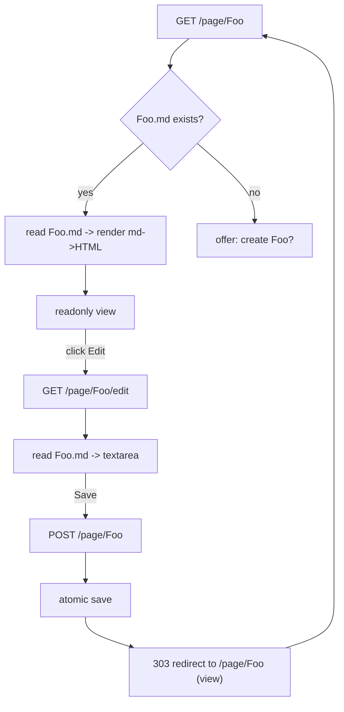
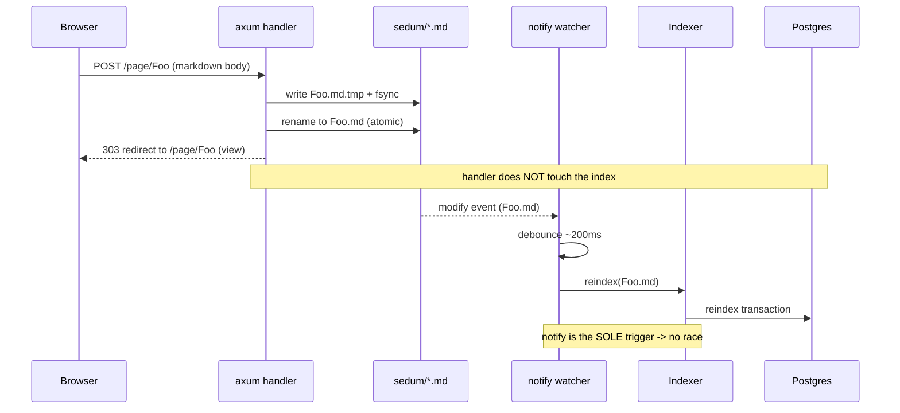
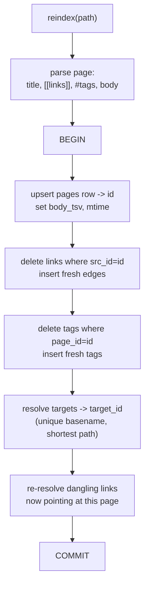
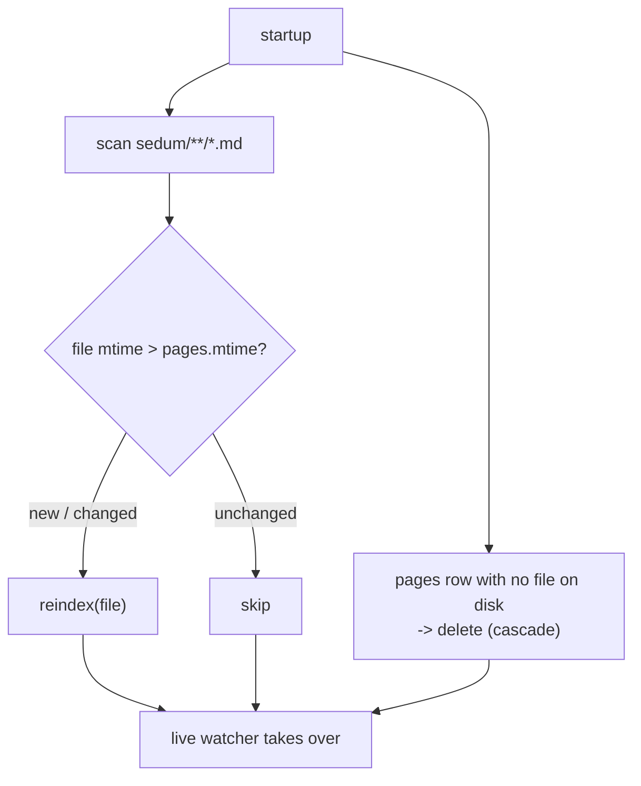
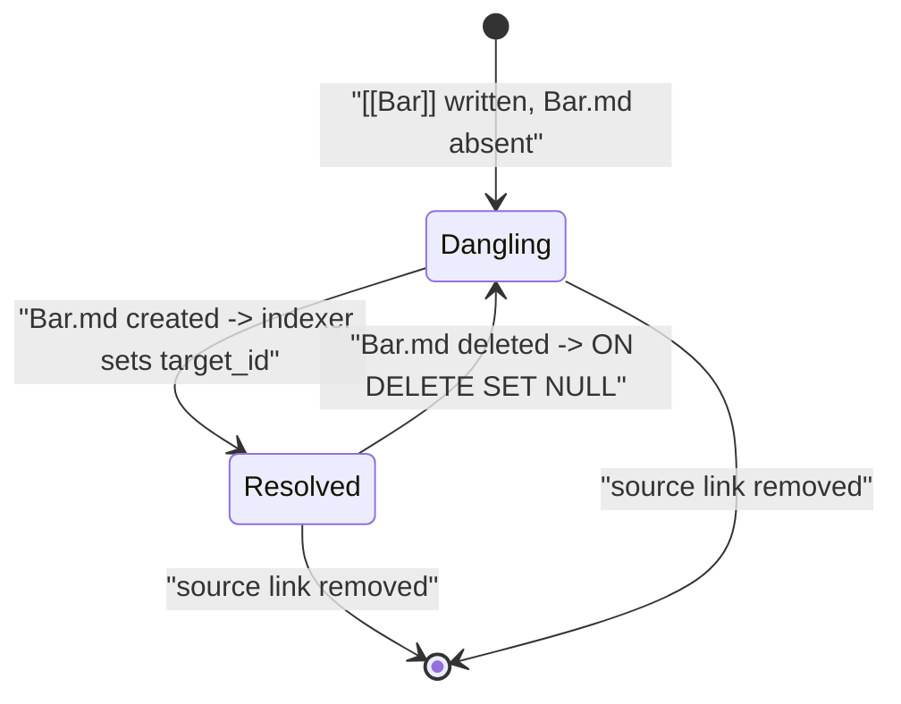
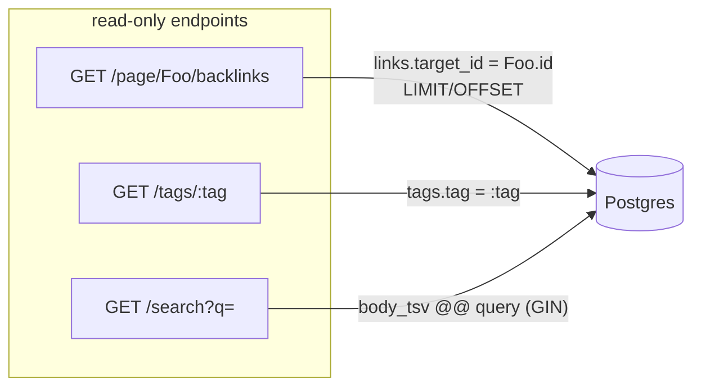

# Dataflow & Workflows

All diagrams are Mermaid. See `docs/architecture.md` for the prose design and
schema.

## 1. System overview

Files are the source of truth; Postgres is a disposable index. HTTP handlers
only **read** Postgres; the background indexer is the **only** writer.

## 2. Rendering model — view vs edit (v0)

The readonly rendered view is the **primary** mode; editing is opt-in. Classic
wiki model, no client JS.

## 3. Save → index contract (single-writer, no race)

The save handler writes the file and returns. It **never** touches the index.
The `notify` watcher is the sole index trigger, so there is no double-index and
no save↔index race.

## 4. Reindex-one-page transaction

One page reindex is a single Postgres transaction.

## 5. Startup reconcile

`notify` can miss events while the process is down, so startup does a full
mtime-based reconcile before the live watcher takes over.

## 6. Link lifecycle (dangling ↔ resolved)

A `[[link]]` may point at a page that does not exist yet. Backlinks appear the
moment the target is created; they go dangling again if it is deleted.

## 7. Read-path queries (no filesystem touch)

Backlinks, tags, and search read **only** Postgres — never the filesystem — and
are paginated so the full edge set is never loaded at once.

