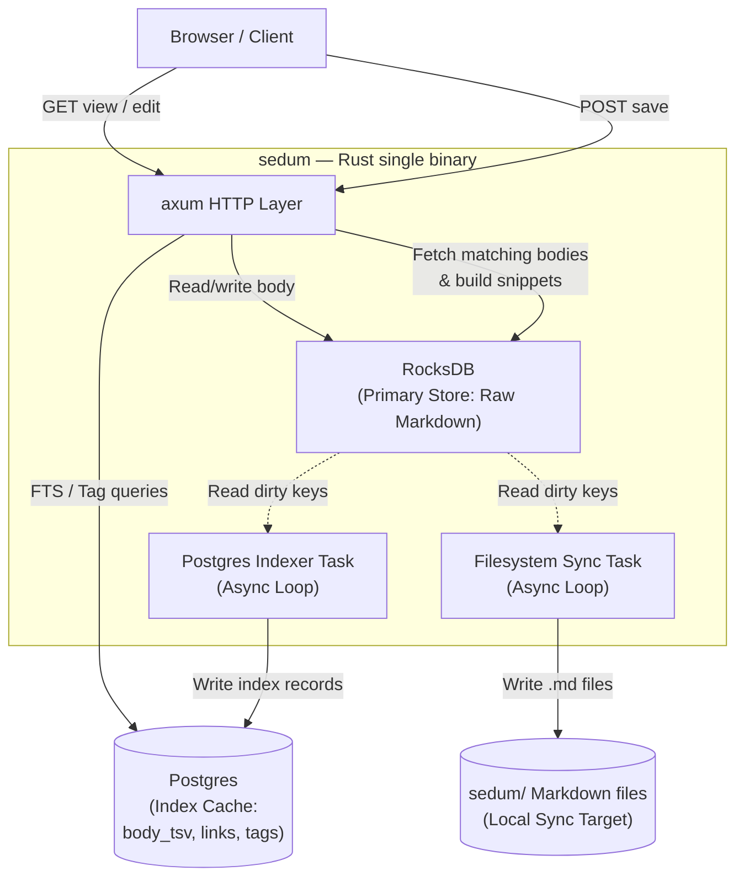
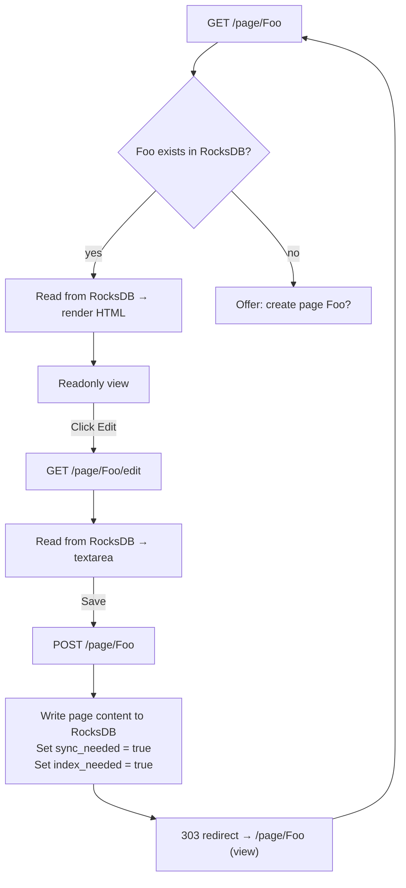
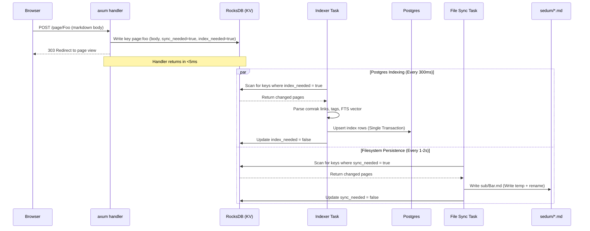
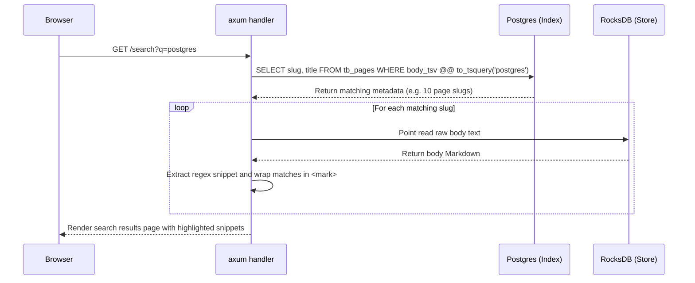
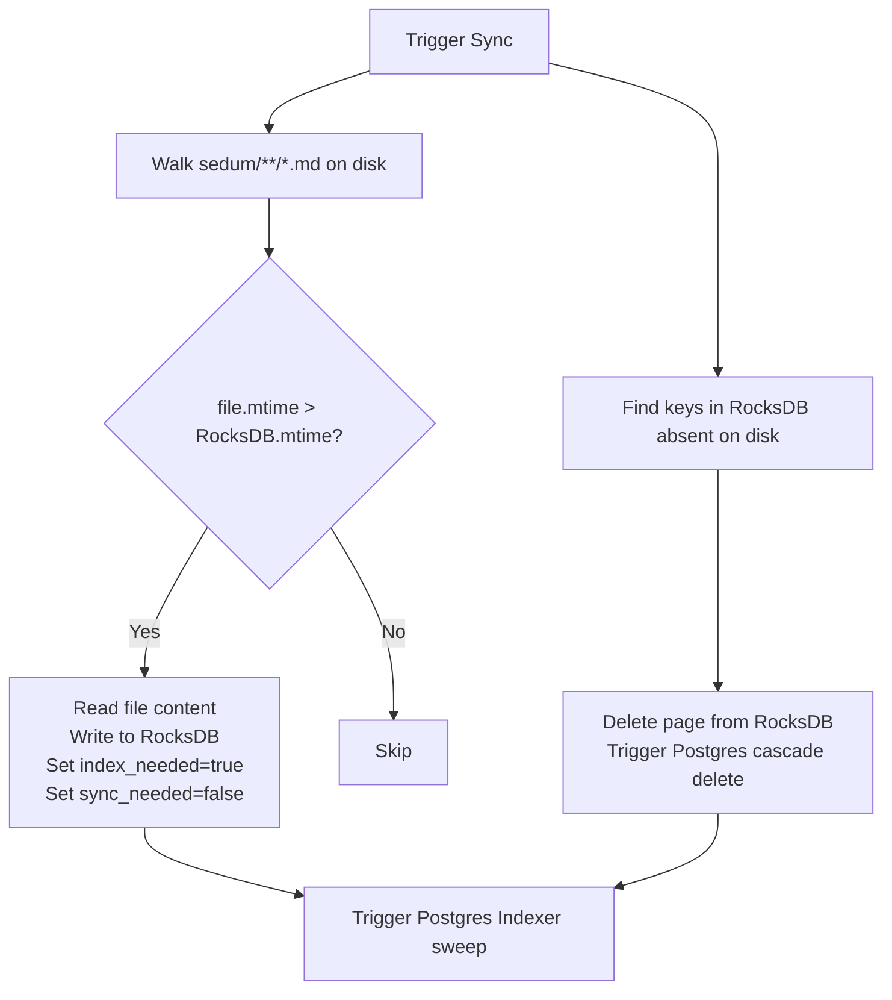

# Dataflow & Workflows (v2)

This document describes the updated dataflow and execution flows for the **RocksDB + Postgres + Filesystem Sync** architecture.

---

## 1. System Overview (v2)

The web server reads and writes primary content from the local **RocksDB** store. **Postgres** acts as the relational index cache for analytical queries (links, tags, search vectors), and the **Local Filesystem** acts as an asynchronous persistence target.

---

## 2. Rendering Model — View vs. Edit

The rendered view reads directly from RocksDB. Pages are edited via a `<textarea>` and saved instantly back to RocksDB.

---

## 3. Save $\rightarrow$ Sync & Index Pipeline

Saves write to RocksDB and return immediately. Background workers perform database indexing and filesystem writes asynchronously.

---

## 4. FTS Search & Snippet Generation Flow

Search queries run on Postgres's GIN vector index. Search snippets are generated in Rust memory after loading matching page bodies from RocksDB.

---

## 5. Directory Reconciliation (Manual Import/Sync)

To handle external filesystem changes (e.g., git pulls, external editor writes), a reconciliation process is triggered manually or by CLI.

