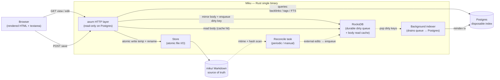
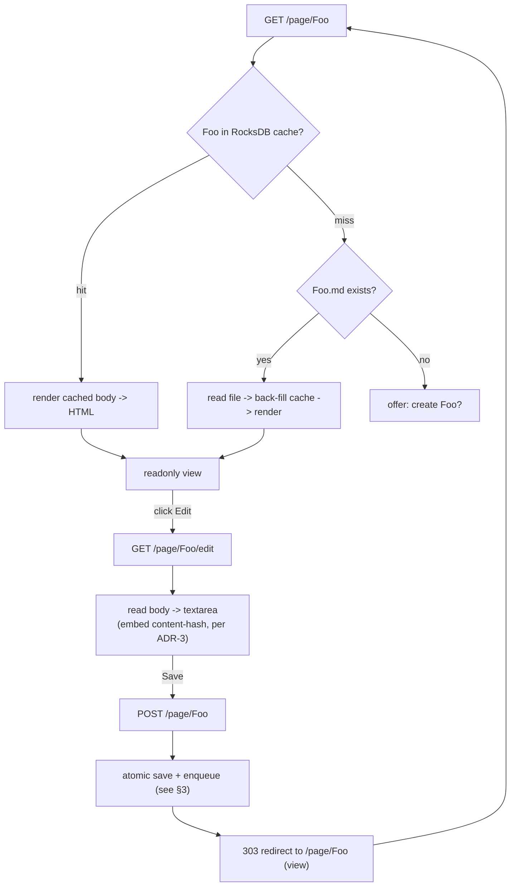
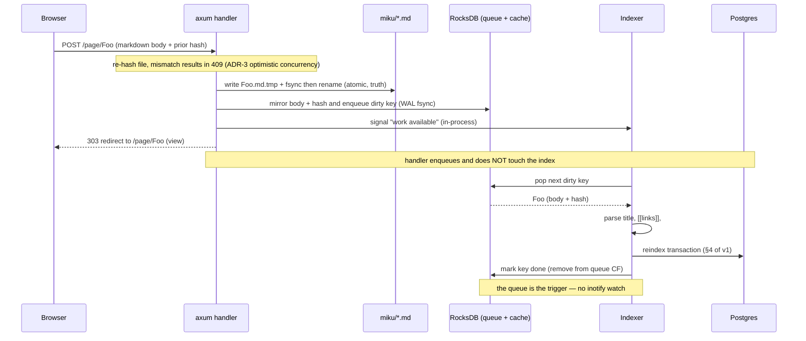
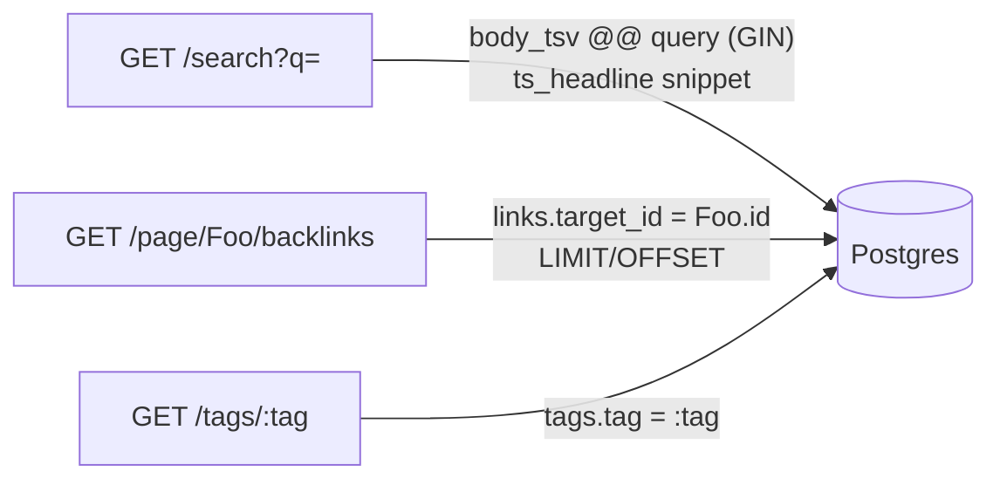
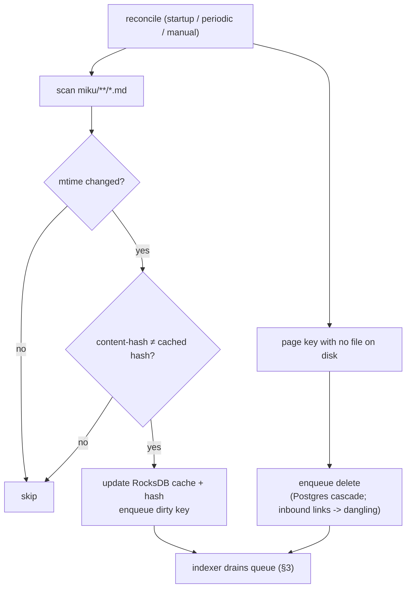

# Dataflow & Workflows (v2 — RocksDB queue for 100k-file scale)

This revises the v1 dataflow (`docs/dataflow.md`) to remove Miku's dependency
on a recursive `notify`/inotify watch, which does not survive the 100k-file
scale target (`architecture.md` → *Vault layout & scale*). It introduces a
**RocksDB durable work-queue + read cache** while keeping the core invariant
intact.

## Why this changes (the notify limit)

v1 uses the `notify` watcher as the **sole** index trigger — even for the app's
own saves: a `POST` writes the file, and the resulting `rename` event is what
tells the indexer to reindex. At 10k–100k files a recursive inotify watch
exceeds `fs.inotify.max_user_watches`, so the *trigger mechanism itself* is what
breaks at scale, not Postgres.

The fix is to stop **watching** for app-originated changes and instead have the
save handler **enqueue** its own index work directly. RocksDB backs that queue
durably, so:

- App saves never depend on a filesystem watch → the inotify budget is a
  non-issue for normal editing.
- The queue survives a crash, so startup **drains the queue** instead of
  re-walking 100k files (a full mtime rescan at that scale is exactly the cost
  we want to avoid).
- External edits (git pull, another editor) are caught by a **periodic
  reconcile** scan rather than a live per-file watch.

**Core invariant preserved.** Markdown files under `miku/` remain the source of
truth — saves still atomic-write the file (temp + `fsync` + `rename`) *before*
enqueuing. **RocksDB and Postgres are both disposable caches**, fully
rebuildable from `miku/**/*.md`; deleting either loses nothing but rebuild
time. RocksDB holds two column families: a durable `queue` CF (pending index
work) and an optional `body` read-cache CF (`slug → body + content-hash + mtime`)
that speeds reads and cheap change-detection.

---

## 1. System overview (v2)

---

## 2. Rendering model — view vs edit

Reads serve from the RocksDB body cache, falling back to the file on a miss
(then back-filling the cache). Editing is opt-in, no client JS — unchanged from
v1 in spirit.

---

## 3. Save → enqueue → index pipeline

The handler writes the file (truth), mirrors the body into RocksDB, and enqueues
a dirty key — then returns. It **never** indexes. The indexer is woken by an
in-process signal (no polling interval) and drains the durable queue; the queue
is also drained on startup, so nothing is lost across a crash.

Crash safety: file write commits the truth; if the process dies before the
enqueue, the periodic reconcile (§5) re-detects the change by content-hash. If it
dies after enqueue but before indexing, the durable queue replays on startup.

---

## 4. FTS search & snippets

Unchanged from v1 and ADR-1: search reads **only** Postgres, snippets via
`ts_headline('english', …)`. The RocksDB body cache is not on the search path —
keeping ADR-1 intact and search a single round-trip.

---

## 5. External-edit reconciliation (replaces the live watch)

External writes (git pull, another editor) have no `notify` event in v2. A
reconcile task — periodic, manual, and run once at startup — walks the tree and
enqueues anything whose content changed. mtime is a cheap pre-filter only;
**content-hash confirms** the change (ADR-3: mtime lies across git/rsync).

Trade-off vs v1: external edits are picked up at reconcile cadence, not
instantly. For app-driven editing this is invisible. Deployments that need live
external-edit pickup *and* stay under the watch budget can add a single
**directory-level** watch on the content root (watch dirs, not files) to trigger
a scoped reconcile — optional, off by default.
