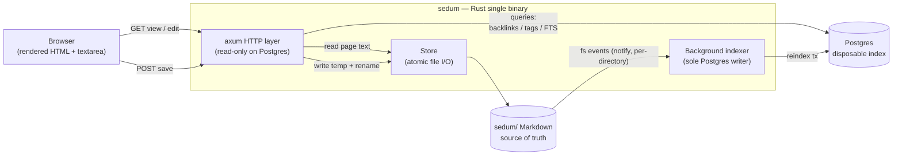
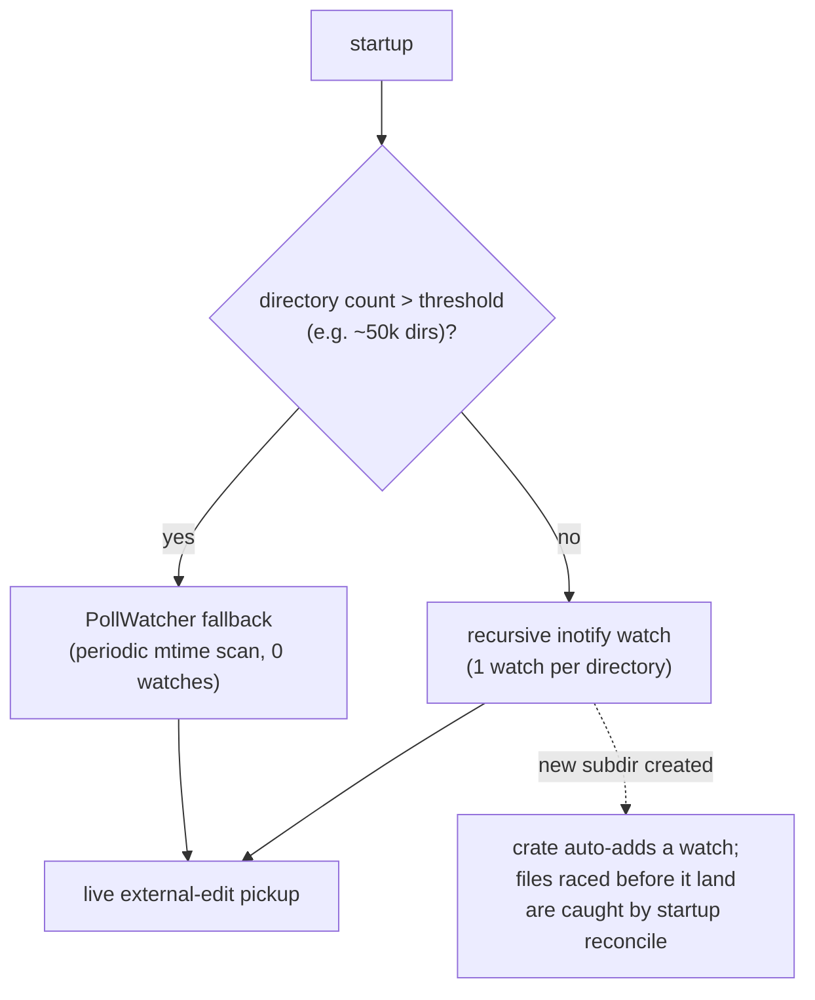
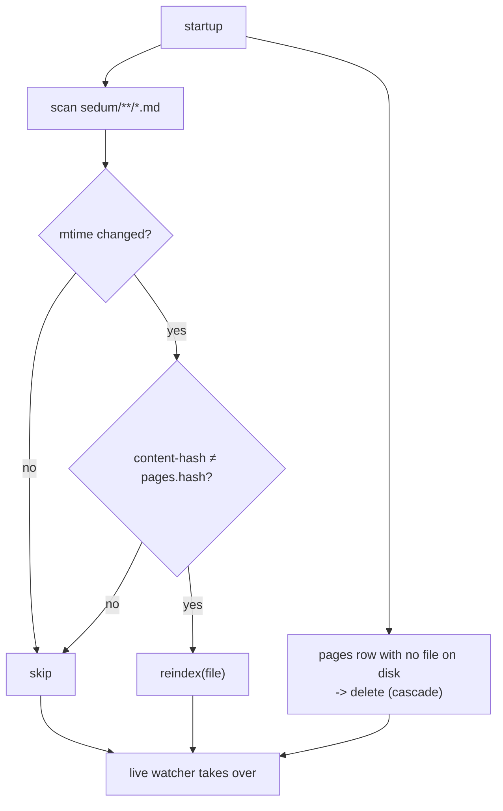

# Dataflow & Workflows (v3 — folder-scoped watching at scale)

**Supersedes v2.** v2 introduced RocksDB to dodge the inotify watch limit. That
limit was misdiagnosed: inotify watches are **per-directory, not per-file**, so a
wiki with sane foldering never approaches it, and RocksDB was solving a problem
sedum doesn't have. v3 keeps the v1 single-writer model unchanged and instead
**corrects the scale story**: watch *folders*, raise one sysctl, fall back to
polling only past a real threshold. No second store, core invariant intact.

## What changed vs v1

Nothing structural — the save/index contract, schema, and read paths are
identical to `docs/dataflow.md`. v3 only makes the watcher's scaling behavior
explicit and adds cheap fallbacks. If you've read v1, you already know v3; skip
to §3 (Scale).

## Why not RocksDB (the notify limit, correctly framed)

On Linux an inotify watch is added **per directory**; that single watch reports
events for every file *directly inside* it. The `notify` crate's
`RecursiveMode::Recursive` walks the tree once and adds **one watch per
subdirectory** (auto-adding a watch when a new subdir appears). So the watch
budget scales with **directory count, not file count**:

- 100k files across ~200 category/subcategory folders → ~200 watches. Default
  `fs.inotify.max_user_watches` is 65k–524k on modern distros. Not close.
- 100k files in *one* folder → **1 watch**. (The pain there is the recursive
  walk and `git status`, not inotify.)
- macOS FSEvents watches paths, not inodes — no per-file limit at all.

The watcher's only irreplaceable job is **live pickup of external edits** (git
pull, another editor) — exactly what serves the "plain files you own, edit
anywhere" thesis. App-originated saves don't strictly need it, but routing them
through the same watcher keeps a single index trigger and no save↔index race
(v1's core property). Both are cheap at folder granularity, so v3 keeps them.

**Core invariant unchanged.** Markdown files under `sedum/` are the source of
truth; Postgres is the sole disposable index, rebuildable from
`sedum/**/*.md`.

---

## 1. System overview



---

## 2. Save → index contract (unchanged from v1)

The save handler writes the file and returns; it **never** touches the index.
The `notify` watcher is the sole index trigger, so there is no double-index and
no save↔index race.

```mermaid
sequenceDiagram
  participant B as Browser
  participant H as axum handler
  participant FS as sedum/*.md
  participant W as notify watcher
  participant I as Indexer
  participant PG as Postgres

  B->>H: POST /page/Foo (markdown body + prior hash)
  Note over H: "re-hash file; mismatch -> 409 (ADR-3 optimistic concurrency)"
  H->>FS: write Foo.md.tmp + fsync then rename (atomic)
  H-->>B: 303 redirect to /page/Foo (view)
  Note over H,PG: handler does NOT touch the index
  FS-->>W: modify event (Foo.md, via its folder watch)
  W->>W: debounce ~200ms
  W->>I: reindex(Foo.md)
  I->>PG: reindex transaction
  Note over W,I: notify is the SOLE trigger → no race
```

---

## 3. Scale — folder-scoped watching + cheap fallbacks

The watcher subscribes at **directory** granularity. Handling the corners:



Three levers, in order of preference:

1. **Watch folders (default).** Already how `notify` recursive mode behaves —
   watch count = directory count. Covers any realistic wiki.
2. **Raise the sysctl.** Document `fs.inotify.max_user_watches` in setup (the
   standard "increase watches" note every IDE ships). One line; covers the rare
   deep-tree case.
3. **`PollWatcher` fallback past a threshold.** The `notify` crate ships a
   polling watcher that uses **zero** inotify watches, trading latency for
   budget. Switch to it only when directory count is genuinely extreme — this is
   the 100k-files-in-archive / `SEDUM_READONLY` territory from
   `architecture.md`.

New-subdirectory race: a file created in a brand-new directory *before* its watch
is registered can be missed. Recursive mode auto-registers the new dir, and the
startup reconcile (§4) sweeps anything missed — so it self-heals.

---

## 4. Startup reconcile (unchanged from v1)

`notify` (or the poll fallback) can miss events while the process is down, so
startup does a full mtime-based reconcile before the live watcher takes over.
mtime is a cheap pre-filter; content-hash confirms (ADR-3 — mtime lies across
git/rsync).



Read-path queries (backlinks, tags, search) are unchanged from v1 §7 — Postgres
only, paginated, never touching the filesystem.
