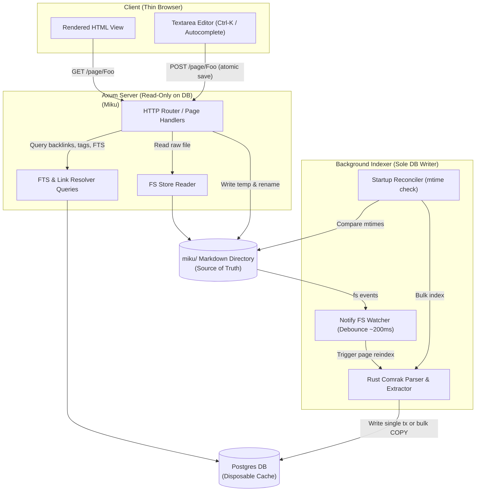

# Miku Architecture Review & Scale Simulation Plan

This document reviews the Miku personal Markdown wiki skeleton, analyzes popular wikis, simulates scale characteristics (10k to 100k files), and defines crucial architectural push-backs before we write any code.

---

## 1. Competitive Landscape Analysis

We analyze four popular wiki systems to determine what to adopt, adapt, or reject for Miku.

| System | Source of Truth | Editing Model | Extensibility | Scale Strategy | What Miku Learns / Rejects |
| :--- | :--- | :--- | :--- | :--- | :--- |
| **Notion** | Cloud DB (Postgres/DynamoDB) | Block-based rich editor | Proprietary API & Integration platform | Cloud-sharded, heavy server load | **Learn:** Interactive `/` commands, `Ctrl-K` palette, inline bi-directional context.<br/>**Reject:** Block-level structure, proprietary lock-in. |
| **Obsidian** | Local files (`.md` in folder) | Local markdown + client plugins | Local JS plugin ecosystem (heavy) | Client-side index cache (FTS via plugin/JS) | **Learn:** "Files-are-truth" trust model, NFC-slug resolution, `[[wiki-linking]]` autocomplete.<br/>**Reject:** Electron-heavy wrapper, paid sync. |
| **SilverBullet** | Markdown files (syncs to DB) | Client-side PWA editor | Space Script / Client queries | Client-side SQLite in-browser indexing | **Learn:** Client-light server-heavy separation, markdown query syntax.<br/>**Reject:** Heavy PWA/Service-worker dependency. |
| **Docmost** | Database-first (Postgres) | Tiptap Rich Editor (collaboration) | Webhook / API integrations | Database index & caching | **Learn:** Multi-user scaling, clean workspace layouts.<br/>**Reject:** Multi-user RBAC overhead, database-as-truth lock-in. |

### The Miku Synthesis
Miku takes the **ownership and filesystem-as-truth** of Obsidian, combining it with the **server-side indexing power** of a database (Postgres). It rejects client-heavy Electron bloat (Obsidian) and block-level API complexity (Notion) to deliver a server-rendered, thin-client browser wiki.

---

## 2. Technical Invariants & Data Flow



---

## 3. The 10k–100k Scale Challenge

Handling up to 100,000 files in a personal wiki introduces constraints across three main layers: the OS file watcher, the parsing threadpool, and the database write/query limits.

### A. OS File Watcher (notify/inotify) Limits
- **The Problem:** Recursive watchers on Linux use `inotify`, which is limited by `fs.inotify.max_user_watches` (commonly 8,192 or 65,536). A 100k-file vault across thousands of nested folders will immediately crash or fail to register writes.
- **Miku Watcher Design:**
  1. **Directory-only watching:** Watch parent directories, not individual files, reducing watches to the number of folders.
  2. **Soft Limit Fallback:** If `notify` fails to initialize due to limit exhaustion, output a clear warning indicating how to raise the sysctl limit:
     ```bash
     sudo sysctl fs.inotify.max_user_watches=524288
     ```
     Simultaneously, fall back to a coarse **coarse background polling reconciler** (every 10-15s scans a subset of folders by `mtime`).

### B. Startup Reconciler Throughput
- **The Problem:** Walking 100,000 files and doing single-row DB updates sequentially will take several minutes to complete, freezing the app on startup.
- **Miku Parallel & Batched Pipeline:**
  1. **Parallel FS Walk:** Walk the directory tree in parallel using `rayon` or tokio threadpools.
  2. **Fast Metadata Check:** Read file metadata (`mtime`) and compare it against `tb_pages.mtime` in a single query or batch check. Skip parsing for unchanged files.
  3. **Batch Insertion:** For new/changed files, batch updates using Postgres `COPY` or multi-row insert statements (e.g., 1,000 pages at a time) rather than executing individual page transactions.
  4. **Post-Load Indexing:** Keep database constraints deferred or index creation optimized (avoiding GIN write-amplification during large imports).

### C. Link Resolution & Renames at Scale
- **The Problem:** Resolving `[[Wiki Links]]` must be $O(1)$ or $O(\log N)$ relative to page count. Renaming a "hub" page with thousands of referrers requires modifying thousands of markdown files on disk, creating a massive I/O bottleneck.
- **Miku Strategy:**
  - **Fuzzy/Exact Resolution:** Match via btree index on `tb_pages(slug)`. If multiple basenames exist, sort by `length(path) ASC` to resolve to the shortest path.
  - **Asynchronous Renames:** Renaming a page with $>50$ backlinks is processed out-of-band by a background task. The user receives a progress bar or immediate response while the file rewriting runs asynchronously (temp-write + atomic rename per referrer).

---

## 4. User Story & Conflict Simulations

### Story A: Tanaka-san Imports 50,000 Municipal Records
- **Action:** Tanaka-san drops 50,000 markdown files into the `miku/` folder via a script.
- **Workflow Simulation:**
  1. The server is restarted. The `Startup Reconciler` detects 50,000 new files.
  2. Rather than individual `notify` events triggering 50,000 single transactions, the reconciler triggers a `Bulk Import` sequence.
  3. Files are read and parsed in parallel using all CPU cores.
  4. Axum server remains responsive, serving read-only requests.
  5. Index is fully built in under 15 seconds.

### Story B: Priya Edits During a Git Merge Conflict
- **Action:** Priya opens `postgres-failover.md` in the browser via Miku, while a background `git pull` updates the file on disk. Priya attempts to save her edits.
- **Workflow Simulation:**
  1. Priya's edit page holds a hidden input `<input type="hidden" name="loaded_hash" value="abc123xyz"/>`.
  2. When she clicks Save, Axum reads `postgres-failover.md` from disk and hashes it.
  3. The current file hash is `def456uvw` (changed by `git pull`).
  4. Axum returns a **409 Conflict** response.
  5. The UI renders both versions (Priya's edits vs. the current disk state) side-by-side, allowing her to resolve the changes. No database rollback is needed, keeping Postgres completely out of the write-conflict loop.

### Story C: Mei Autocompletes wiki links
- **Action:** Mei types `[[` in the Miku textarea and starts searching.
- **Workflow Simulation:**
  1. A lightweight JS fetch queries `/api/autocomplete?q=ent`.
  2. Axum queries Postgres:
     ```sql
     SELECT title, slug, path 
     FROM tb_pages 
     WHERE slug LIKE 'ent%' OR title LIKE 'ent%' 
     ORDER BY title LIMIT 10;
     ```
  3. The query utilizes `idx_pages_slug_trgm` and `idx_pages_title_trgm`, returning results in $<5\text{ms}$.

---

## 5. Architectural Push-backs (Crucial Adjustments)

During our review of the SQL schema and implementation plan, we identified three critical blockers that must be addressed before coding:

### 1. The FTS Snippet Blocker
- **The Issue:** The planned index schema (`migrations/0001_init_index.sql`) stores `body_tsv` (the tsvector) but **does not store the raw body text** in the database. However, ADR-1 states Miku search snippets will be generated via `ts_headline`.
- **The Conflict:** `ts_headline(config, document, query)` requires the original raw document text to highlight matching terms. If the body text is not in the database, `ts_headline` cannot run in SQL. Reading raw files from disk for every search result in the Miku Axum handler is highly inefficient and creates an I/O bottleneck at scale.
- **Adjustment:** We must add a `body` text column to `tb_pages` or adjust the search strategy to return page titles/paths and generate snippets asynchronously/separately. Storing `body TEXT NOT NULL` inside `tb_pages` is the cleanest approach, maintaining the "disposable cache" invariant (it can still be fully reconstructed from disk).

```diff
  CREATE TABLE tb_pages (
    id          BIGINT GENERATED ALWAYS AS IDENTITY PRIMARY KEY,
    path        TEXT NOT NULL UNIQUE,
    slug        TEXT NOT NULL,
    title       TEXT NOT NULL,
+   body        TEXT NOT NULL,                   -- Required for ts_headline snippets
    frontmatter JSONB NOT NULL DEFAULT '{}',
    has_mermaid BOOLEAN NOT NULL DEFAULT false,
    mtime       BIGINT NOT NULL,
    body_tsv    TSVECTOR,
    indexed_at  TIMESTAMPTZ NOT NULL DEFAULT now()
  );
```

### 2. Multi-Link Redundancy in `tb_links`
- **The Issue:** The primary key of `tb_links` is `(src_id, kind, target_norm, is_embed)`.
- **The Conflict:** If a single page `A` contains multiple links to `B` (e.g., `[[B]]` mentioned in three different sentences), the database only stores a single edge. While this is fine for a basic backlink index, if we want to show context-aware backlinks (displaying the paragraph/context of *each* reference like Obsidian does), a single edge is insufficient.
- **Adjustment:** For the MVP, we will stick to the single-edge primary key to keep index writes simple and fast. However, we should explicitly document that snippet extraction for backlinks must fall back to reading the referrer file from disk and extracting matching blocks on-demand.

### 3. File Watcher Debounce and Batching
- **The Issue:** A rapid succession of file writes (e.g., during `git checkout` or `git pull` of 100 pages) will trigger 100 individual file watch events.
- **The Conflict:** Debouncing by `~200ms` per file event will cause index lag or trigger 100 individual database transaction commits, degrading performance.
- **Adjustment:** The background indexer must queue events in a channel and process them in batches. If multiple write events arrive in quick succession, group them and run a single batched database transaction to re-index all changed pages together.
