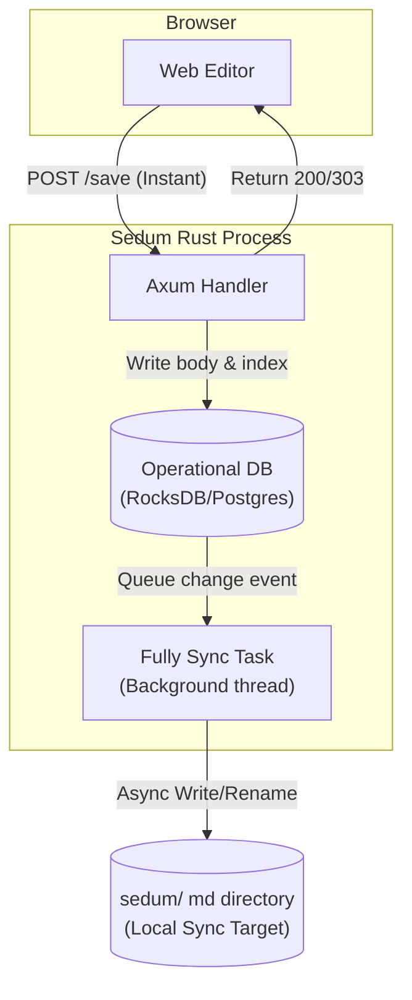

# Storage Design: File-First vs. DB-First (RocksDB/Sync)

This document outlines the architectural trade-offs of shifting from a **File-First** model (where local files are the immediate source of truth) to a **DB-First / RocksDB** model with a **One-Side Modification** restriction and a `fully sync` background task.

---

## 1. Architectural Options Comparison

### Option A: The Original File-First Model (Postgres Index)
- **Concept:** Files on disk (`sedum/` folder) are read and written directly on HTTP requests. Postgres acts solely as a disposable index cache for backlinks, tags, and search.
- **Modification:** Two-side (browser edits and external file edits via Vim/git/VS Code are both supported).
- **Scale Issues:** Hits Linux file watcher limits; disk I/O on page reads/saves at 100k scale can lag.

### Option B: The DB-First Model (Postgres/RocksDB-First + Filesystem Sync)
- **Concept:** The web application reads and writes exclusively to a database (Postgres or an embedded key-value store like RocksDB). The server requires **no local files** during live operation.
- **Sync Mechanism:** A background `fully sync` worker asynchronously exports database records to `.md` files in a local directory (or imports them if the file folder is updated).
- **Modification:** **One-side modification only** (typically Web-UI edits write to DB $\rightarrow$ syncs to files. Manual disk modifications are not dynamically watched).

---

## 2. Why RocksDB?

RocksDB is an embedded, LSM-tree key-value store optimized for fast storage (especially on SSDs).

### Pros of RocksDB in Sedum
1. **Zero External Dependency:** Unlike Postgres, RocksDB is embedded as a library inside the Rust binary. This aligns perfectly with a single-binary, local-first product positioning.
2. **Extreme Write/Read Performance:** LSM-trees handle high-throughput writes (append-only memtables flushed to SSTs) and point reads in microseconds, completely removing filesystem write overhead.
3. **No File Watcher / OS Limits:** Because the app reads/writes to RocksDB, there are no directory watches, solving the recursive inotify exhaustion problem.

### Cons & Technical Friction
1. **Dual DB overhead:** If we keep Postgres (for GIN search, backlinks joins, relational queries) *and* add RocksDB (for page body/document storage), we double database complexity.
2. **Replacing Postgres with RocksDB:** If we replace Postgres entirely with RocksDB, we lose native SQL queries, pg_trgm fuzzy search, and GIN `tsvector` full-text search. We would have to implement backlinks resolution and search indexing in pure Rust (e.g., using `tantivy` for FTS).
3. **Loss of "Files-are-Truth" Simplicity:** If RocksDB is the primary store, the plain markdown files are no longer the immediate source of truth. Users editing files via terminal or Git must run a manual synchronization command (`sedum sync`) to import files into RocksDB before they appear in the browser.

---

## 3. Data Flow: One-Side Modification (Web-First)

In this model, the Web UI is the sole writer. Filesystem writes are deferred and handled asynchronously.

### The "Fully Sync" Sync Task
To prevent file I/O from blocking request handlers, we decouple database writes from file exports:
1. **The DB Log / Sync State:** We maintain a `sync_status` flag on each page in the database (e.g., `DIRTY` vs. `SYNCED`).
2. **Background Exporter:** A thread loops periodically (e.g., every 5 seconds). It finds all `DIRTY` pages in the DB, writes them out to their corresponding filesystem paths under `sedum/`, and marks them `SYNCED`.
3. **Bulk Importing (One-Way):** If the user updates files externally (e.g., via `git pull`), they trigger `POST /api/sync` or run `sedum --sync`. This performs a full directory walk, compares file `mtimes` against the DB, and rebuilds the DB records.

---

## 4. Synthesis & Recommendation

If we adopt **Option B (One-Side Modification / DB-First)**:

1. **We solve the Watcher Limit (Point 2):** We no longer need a live file watcher (`notify`) at all because modifications only flow from the Web UI to the DB. File exports are sequential and batch-driven.
2. **We resolve Point 3 (Rate-limiting):** Write-heavy saves only hit the DB (which easily handles thousands of ops/sec). The background sync writer throttles writing to disk.

### The Decisive Question: Do we use RocksDB or Postgres?
Since the database configuration (`migrations/0001_init_index.sql`) is already set up for Postgres, we have two paths:

- **Path A: Postgres-First (No RocksDB):** We use Postgres as the primary store (adding the `body` column as approved in Point 1) and run the `fully sync` background task to export Postgres rows to files.
- **Path B: RocksDB + Tantivy (Drop Postgres):** We discard Postgres entirely, making Sedum a self-contained single-binary with RocksDB (for page storage) and Tantivy (for search index). This eliminates the Postgres installation requirement for users.
