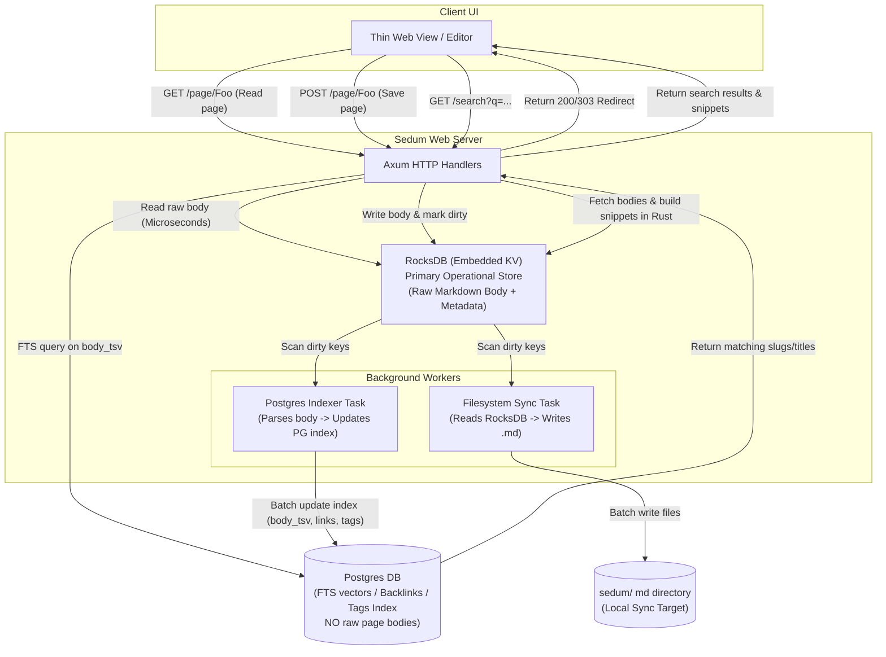

# Corrected Hybrid Storage: RocksDB + Postgres (No Page Body in PG)

This design corrects the hybrid architecture to keep the **page body exclusively in RocksDB and local files**, keeping Postgres small and optimized for analytical indexing (search vectors, tags, and links).

---

## 1. Core Architecture Diagram



---

## 2. Decoupled Data Model

### A. RocksDB (Primary KV Store)
- **Key Pattern:** `page:<slug>`
- **Value Schema (JSON or binary format):**
  ```json
  {
    "path": "sub/Bar.md",
    "slug": "bar",
    "title": "Bar",
    "body": "# Bar\nThis is the raw markdown content...",
    "frontmatter": {},
    "mtime": 1719323145,
    "sync_needed": true,
    "index_needed": true
  }
  ```

### B. Postgres (FTS & Relation Index)
Postgres does **not** store the raw page body text. It only stores the search vector (`body_tsv`) and structural data:

```sql
CREATE TABLE tb_pages (
  id          BIGINT GENERATED ALWAYS AS IDENTITY PRIMARY KEY,
  path        TEXT NOT NULL UNIQUE,
  slug        TEXT NOT NULL,
  title       TEXT NOT NULL,
  frontmatter JSONB NOT NULL DEFAULT '{}',
  has_mermaid BOOLEAN NOT NULL DEFAULT false,
  mtime       BIGINT NOT NULL,
  body_tsv    TSVECTOR, -- Search vector (populated by indexer parsing the body)
  indexed_at  TIMESTAMPTZ NOT NULL DEFAULT now()
);
```

---

## 3. Search & Snippet Generation Flow

Because the raw body text is stored in RocksDB and not Postgres, snippet generation (`ts_headline`) is handled by the Axum server process:

1. **Search Request:** The user searches for `"postgres failover"`.
2. **Postgres Search Query:**
   ```sql
   SELECT slug, title, path 
   FROM tb_pages 
   WHERE body_tsv @@ to_tsquery('english', 'postgres & failover')
   ORDER BY ts_rank(body_tsv, to_tsquery('english', 'postgres & failover')) DESC
   LIMIT 10;
   ```
   *Note: This query is extremely fast because it only performs a index scan on the GIN vector index and returns small metadata fields (slug, title, path).*
3. **Snippet Generation in Rust:**
   - Axum receives the matching slugs.
   - For each matching slug, Axum performs a **point read** in RocksDB to get the raw `body` text. Since RocksDB is embedded, fetching 10 records takes $<0.5\text{ms}$ total.
   - Axum uses a Rust regex/text helper to extract matching snippets and highlight terms (e.g. wrapping search terms in `<mark>` tags).
4. **Response:** Axum renders the search results page with the generated snippets.
