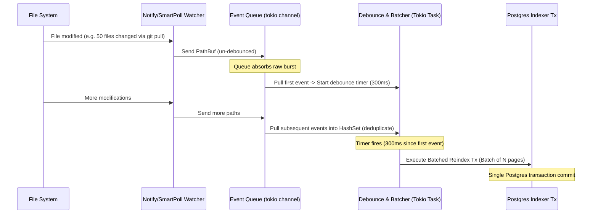

# Watcher Scaling & Rate-Limiting Event Queue Plan

This plan details the design for resolving **Recursive Watcher Exhaustion** (Linux inotify limits) and implementing a **Rate-Limited Batching Queue** for file system events.

---

## 1. Exploring Popular Solutions for File Watcher Limits

When monitoring large file trees (10k to 100k files), the primary bottleneck on Linux is the `inotify` watch limit. Each watched subdirectory requires a separate watch descriptor. If this limit is exceeded, the watcher fails with `ENOSPC` or `MaxFilesWatch`.

Here is how popular developer tools handle this:

| Tool | Engine | Strategy | Pros / Cons |
| :--- | :--- | :--- | :--- |
| **VS Code** | Custom watcher (`nsfw` / native wrapper) | 1. Exclude heavy dirs (`node_modules`, `.git`, `.trash`) by default.<br/>2. Warn user on `ENOSPC` with systemd/sysctl config commands. | **Pros:** High performance, user-actionable.<br/>**Cons:** Watcher stops working if limit isn't raised. |
| **Obsidian** | `chokidar` (Node.js) | Displays a UI notification pointing to help docs on how to increase `fs.inotify.max_user_watches`. | **Pros:** Safe fallback documentation.<br/>**Cons:** No fallback mechanism; indexing halts until user acts. |
| **Watchman** | Native C / OS APIs | 1. Heavy sysctl warning on startup.<br/>2. High-performance caching & query interface.<br/>3. Ignores VCS folders. | **Pros:** Monorepo scale performance.<br/>**Cons:** Heavy daemon dependency; too complex for a personal wiki. |
| **SilverBullet** | `Deno.watchFs` | Restarts/fails to watch, requiring manual intervention or raising limits. | **Pros:** Simple implementation.<br/>**Cons:** Brittle at scale. |

### Miku Strategy: Dual-Path Watcher (Notify + Smart Polling Fallback)
For Miku, we will implement a robust two-layer strategy:

1. **Strict Target Exclusion:**
   - Always exclude `.git/`, `.trash/`, and `assets/` from the recursive watch. This prevents system files and raw binaries from consuming watch descriptors.
2. **Auto-Detection & Sysctl Onboarding:**
   - On startup, check `/proc/sys/fs/inotify/max_user_watches` (on Linux).
   - If the folder count in `miku/` exceeds $80\%$ of this limit, print a prominent warning log indicating how to increase the limit permanently:
     ```bash
     echo "fs.inotify.max_user_watches=524288" | sudo tee -a /etc/sysctl.conf && sudo sysctl -p
     ```
3. **Smart Polling Fallback:**
   - If `notify::RecommendedWatcher` fails to initialize with an `ENOSPC` or watch limit error, **do not crash**.
   - Fall back to a `SmartPollWatcher`.
   - **How Smart Polling works at 100k scale:**
     - Instead of scanning all 100k files recursively (which takes seconds and spikes disk I/O), we scan directory metadata (`mtime` of directories).
     - On modern filesystems (ext4, XFS, APFS), a directory's `mtime` changes when any file inside it is added, deleted, or renamed.
     - We only recursively check files in subdirectories whose `mtime` is greater than our last indexing checkpoint. This reduces the scan from 100,000 stats to a few hundred directory stats, executing in milliseconds.

---

## 2. Rate-Limiting & Batching Event Queue (Task 3 Plan)

To prevent database lockups and CPU spikes during bulk operations (e.g., `git pull`, `git checkout`, or script runs), we cannot process watcher events synchronously one-by-one.

### The Lifecycle of an Event


### Queue Engine Design (Rust Spec)

We will implement this in a dedicated `indexer` module using a thread-safe actor-like pattern:

```rust
use std::collections::HashSet;
use std::path::PathBuf;
use tokio::sync::mpsc;
use tokio::time::{sleep, Duration};

/// The internal event representation
#[derive(Debug, Clone)]
pub enum WatcherEvent {
    Modified(PathBuf),
    Deleted(PathBuf),
}

pub struct IndexerQueue {
    sender: mpsc::Sender<WatcherEvent>,
}

impl IndexerQueue {
    pub fn new(db_pool: sqlx::PgPool, content_root: PathBuf) -> Self {
        let (sender, receiver) = mpsc::channel(1024);
        
        // Spawn the consumer background actor
        tokio::spawn(async move {
            Self::run_consumer(receiver, db_pool, content_root).await;
        });

        Self { sender }
    }

    pub async fn push(&self, event: WatcherEvent) -> Result<(), mpsc::error::SendError<WatcherEvent>> {
        self.sender.send(event).await
    }

    async fn run_consumer(
        mut receiver: mpsc::Receiver<WatcherEvent>,
        db_pool: sqlx::PgPool,
        content_root: PathBuf,
    ) {
        let mut debounce_buffer = HashSet::new();
        let debounce_duration = Duration::from_millis(300);

        while let Some(event) = receiver.recv().await {
            debounce_buffer.insert(event);

            // Drain any pending events immediately available
            while let Ok(evt) = receiver.try_recv() {
                debounce_buffer.insert(evt);
            }

            // Sleep to let more changes accumulate (debounce window)
            sleep(debounce_duration).await;

            // Drain again to capture anything that arrived during sleep
            while let Ok(evt) = receiver.try_recv() {
                debounce_buffer.insert(evt);
            }

            // Process the accumulated batch
            if !debounce_buffer.is_empty() {
                let batch: Vec<WatcherEvent> = debounce_buffer.drain().collect();
                if let Err(e) = Self::process_batch(batch, &db_pool, &content_root).await {
                    tracing::error!("Failed to index batch: {:?}", e);
                }
            }
        }
    }

    async fn process_batch(
        batch: Vec<WatcherEvent>,
        db_pool: &sqlx::PgPool,
        content_root: &PathBuf,
    ) -> Result<(), anyhow::Error> {
        // Group edits vs deletions
        let mut to_upsert = Vec::new();
        let mut to_delete = Vec::new();

        for event in batch {
            match event {
                WatcherEvent::Modified(p) => to_upsert.push(p),
                WatcherEvent::Deleted(p) => to_delete.push(p),
            }
        }

        // Run the batch inside a SINGLE database transaction
        let mut tx = db_pool.begin().await?;

        // 1. Process deletions (soft delete to .trash, remove from DB)
        for path in to_delete {
            // Run db delete
            sqlx::query!("DELETE FROM tb_pages WHERE path = $1", path.to_string_lossy().to_string())
                .execute(&mut *tx)
                .await?;
        }

        // 2. Process upserts
        for path in to_upsert {
            // Read, parse comrak, extract title/links/tags/body
            // Upsert into tb_pages, tb_links, tb_tags, tb_page_aliases
            // (Uses helper parsing routines)
        }

        // 3. Resolve target_ids of all dangling links pointing to newly created pages
        // 4. Commit transaction
        tx.commit().await?;

        Ok(())
    }
}
```

### Rate Limiting & Safety Controls
To protect system resources at 100k files:
1. **Queue Capacity Guard:** The channel capacity is capped at `1024` events. If the channel fills up (e.g., massive manual copying), we drop incoming events and trigger a **full folder scan / reconcile sweep** instead. This keeps memory usage bounded.
2. **Throttling DB Writes:** The debounce timer of `300ms` ensures a maximum of ~3 DB transactions per second. This prevents hammering Postgres during rapid key-saves or concurrent batch updates.
3. **Task Priority:** The indexer background task runs under tokio's default scheduler, letting the HTTP Axum router threads take priority for processing user page reads and writes.
