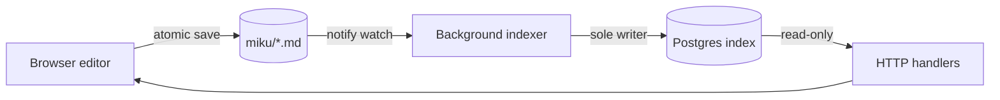

# Miku Features

Miku combines filesystem simplicity with wiki intelligence. This page describes the core features that make the system work. #feature #guide

> [!NOTE]
> Your Markdown files under `miku/` are the source of truth. Postgres holds only
> a disposable index that is fully rebuildable from those files.

## Architecture at a Glance

Saves flow through an atomic write; the filesystem watcher is the *only* trigger
for the background indexer, which is the sole writer to the Postgres index:



> [!IMPORTANT]
> HTTP handlers are read-only against Postgres. Never index inside the save
> handler — the `notify` watcher is the single index trigger, which keeps the
> single-writer model race-free.

## Wikilinks

Pages are connected using the `[[PageName]]` syntax. When you write `[[Index]]`, Miku automatically renders it as a clickable link to the Index page. Wikilinks are the foundation of knowledge organization in Miku — they let you think in a network of ideas rather than a linear hierarchy.

The wikilink parser respects case-insensitive page matching, so `[[index]]` and `[[Index]]` both work. Behind the scenes, the indexer crawls your Markdown files, extracts every wikilink, and builds a graph.

## Backlinks

Write a [[Features]] link on any page, and Miku automatically shows you everywhere [[Features]] is mentioned. Backlinks surface unexpected connections and help you navigate your wiki without manually maintaining "see also" lists.

The backlinks panel loads on demand, so large, densely-connected wikis stay responsive. See the architecture docs for pagination strategy.

## Tags

Sprinkle `#hashtags` naturally in your prose. Miku extracts them, indexes them, and provides a tag-based filter view. Unlike rigid category systems, tags are informal and additive — the same page can have #docs, #feature, and #guide simultaneously.

The tag index is rebuilt as you save, and the `/tags` view lets you browse pages grouped by tag or navigate to a single tag's pages. #feature

## Full-Text Search

Every page is indexed for full-text search. Type in the search box and find any phrase or word across your entire wiki. The search respects Markdown structure, so searches for content in code blocks and links work as expected. #feature

Search is powered by Postgres full-text indexing and runs asynchronously, so it never blocks edits. Results are ranked by relevance.

## Syntax Highlighting

Fenced code blocks are highlighted client-side by Prism, which loads the grammar
for each language on demand. Tag a fence with a language to get colors:

```rust
fn extract_tags(body: &str) -> Vec<String> {
    body.split_whitespace()
        .filter_map(|w| w.strip_prefix('#'))
        .map(str::to_owned)
        .collect()
}
```

```python
def slugify(name: str) -> str:
    return name.strip().lower().removesuffix(".md")
```

```typescript
const move = async (from: string, to: string): Promise<void> => {
  const body = new URLSearchParams({ from, to });
  await fetch("/api/move", { method: "POST", body });
};
```

```sql
SELECT path, title
FROM tb_pages
WHERE body_tsv @@ websearch_to_tsquery('english', $1)
ORDER BY ts_rank(body_tsv, websearch_to_tsquery('english', $1)) DESC;
```

```bash
make run        # start the server
make check      # fmt-check + lint + test
```

> [!TIP]
> An unlabeled fence renders as plain monospace — only labeled fences are
> colorized.

## Atomic Saves

When you save a page, Miku writes to a temporary file, then atomically renames it into place. This guarantees that the wiki is never left in a partially-written state — even if the server crashes mid-save, your data stays consistent.

The atomic save also triggers the background indexer to refresh affected pages only, so you never wait for a full re-index. #feature

## Background Indexer

The indexer runs continuously in the background, watching the `miku/` directory for changes. It is the sole writer to the Postgres index — HTTP handlers only read. This single-writer model eliminates races and double-indexing bugs.

When a page is edited or created, the indexer extracts wikilinks, tags, and full-text content, updating the pages, links, and tags tables in Postgres. The index is fully rebuildable from your `.md` files, so it's safe to drop and recreate at any time. See [[Usage]] for how to trigger a full re-index. #feature

## No Fragmentation

Because your wiki lives in `miku/` alongside your git history, every page is version-controlled by default. You can see when [[Index]] was last edited, revert a broken save, and audit changes over time. Miku never creates orphaned or unreachable pages — every file is either on disk or deleted and gone from history.

> [!TIP]
> Drag a page onto a folder in the sidebar to move it, or drop it on empty space
> to send it back to the top level.

> [!WARNING]
> Deleting a page moves it to `miku/.trash/`. It is removed from the live index,
> but the file is not permanently erased — clear the trash folder yourself when
> you are sure.

---

For a hands-on introduction, see [[Sandbox]]. To get Miku running, see [[Usage]].
